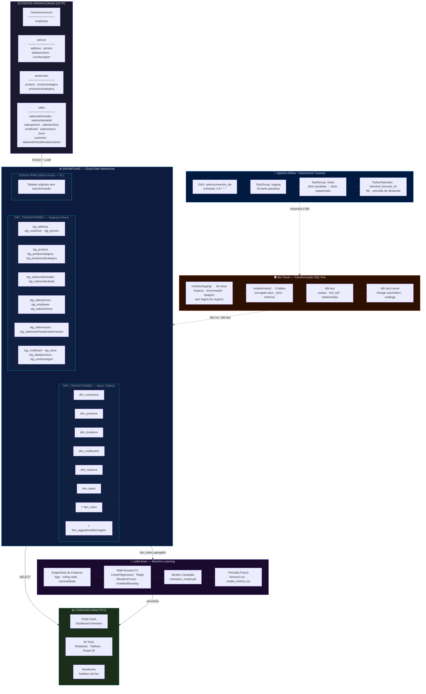
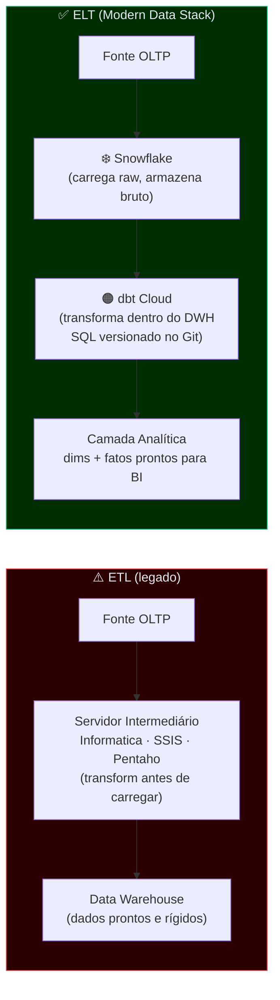
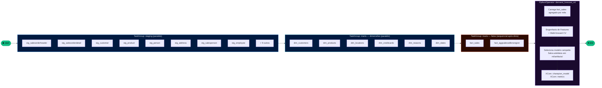

# AdventureWorks DW

<p align="center">
  
  
  
  
  
  
</p>

<p align="center">
  <strong>Data Warehouse moderno sobre o dataset AdventureWorks, construído com as melhores práticas do Modern Data Stack.</strong><br/>
  Snowflake · dbt Cloud · Apache Airflow + Astronomer Cosmos · Plotly Dash · scikit-learn ML
</p>

---

## Índice

1. [Visão Geral](#1-visão-geral)
2. [Arquitetura Modern Data Stack](#2-arquitetura-modern-data-stack)
3. [ELT — O Paradigma Moderno](#3-elt--o-paradigma-moderno)
4. [Snowflake — Plataforma de Dados em Nuvem](#4-snowflake--plataforma-de-dados-em-nuvem)
5. [dbt Cloud — Transformação como Código](#5-dbt-cloud--transformação-como-código)
6. [Apache Airflow — Orquestração](#6-apache-airflow--orquestração)
7. [Modelagem Dimensional](#7-modelagem-dimensional)
8. [Perguntas de Negócio Respondidas](#8-perguntas-de-negócio-respondidas)
9. [Estrutura do Repositório](#9-estrutura-do-repositório)
10. [Como Executar](#10-como-executar)
11. [Testes e Qualidade de Dados](#11-testes-e-qualidade-de-dados)
12. [Boas Práticas](#12-boas-práticas)
13. [Machine Learning — Previsão de Demanda](#13-machine-learning--previsão-de-demanda)

---

## 1. Visão Geral

Este projeto implementa um **Data Warehouse analítico** completo sobre o conjunto de dados **AdventureWorks** — empresa fictícia de fabricação e distribuição de bicicletas da Microsoft — utilizando as ferramentas que definem o **Modern Data Stack** de mercado.

O pipeline cobre todo o ciclo de vida dos dados, da fonte à visualização:

| Etapa | Tecnologia | Função |
|---|---|---|
| Armazenamento & Compute | **Snowflake** | Cloud data warehouse com separação storage/compute |
| Transformação | **dbt Cloud** | SQL analítico versionado, testado e documentado |
| Orquestração | **Apache Airflow + Astronomer Cosmos** | Agendamento e monitoramento do pipeline |
| Visualização | **Plotly Dash** | Dashboard interativo com tema profissional escuro |
| Machine Learning | **scikit-learn** | Previsão de demanda mensal com walk-forward CV |

O dataset cobre **maio/2011 a junho/2014**, com mais de **31 mil pedidos de venda**, **19 mil clientes únicos** e receita total superando **US$ 109 milhões**.

---

## 2. Arquitetura Modern Data Stack

O diagrama abaixo representa o fluxo completo de dados, das fontes operacionais (OLTP) ao consumo analítico, passando pelas camadas técnicas de cada ferramenta do stack:



---

## 3. ELT — O Paradigma Moderno

### ETL vs ELT

O padrão tradicional **ETL** (Extract → Transform → Load) exigia transformar dados em servidores intermediários antes de carregá-los, gerando pipelines rígidos e de alto custo operacional. O paradigma **ELT** inverte a ordem, aproveitando o poder de processamento do próprio cloud data warehouse:



| Dimensão | ETL | ELT |
|---|---|---|
| Escalabilidade | Limitada pelo servidor intermediário | Elástica — usa o compute do Snowflake |
| Versionamento | Ferramentas proprietárias com GUI | SQL no Git — PRs, `dbt run`, lineage |
| Time to insight | Dias para alterar uma transformação | Minutos — edita `.sql`, executa `dbt run` |
| Rastreabilidade | Difícil | Lineage automático via dbt docs |
| Custo | CAPEX alto (licenças + servidores) | OPEX elástico — paga pelo que usa |
| Testabilidade | Quase inexistente | Testes built-in com `dbt test` |

---

## 4. Snowflake — Plataforma de Dados em Nuvem

O Snowflake foi escolhido por sua arquitetura **multi-cluster shared data**, que separa armazenamento de processamento. Isso permite múltiplos workloads simultâneos sem concorrência de recursos, escalabilidade elástica e cobrança granular.

### Recursos utilizados

| Recurso Snowflake | Aplicação neste projeto |
|---|---|
| **Virtual Warehouses** | `COMPUTE_WH` para dbt; warehouse separado para dashboard |
| **Micro-particionamento** | Pruning automático por `orderdate` em `fact_sales` |
| **Time Travel** | Recuperação de dados após falhas (até 90 dias — Enterprise) |
| **Zero-Copy Cloning** | Ambientes dev/staging sem duplicação de storage |
| **RBAC** | Roles `LOADER`, `TRANSFORMER`, `REPORTER` com privilégio mínimo |
| **Separação Storage/Compute** | Dashboard e dbt usam warehouses independentes sem concorrência |

### Arquitetura interna Snowflake

```
┌─────────────────────────────────────────────────────────────┐
│                    CLOUD SERVICES LAYER                      │
│        Metadados · Otimizador · Segurança · RBAC            │
└────────────────────────┬────────────────────────────────────┘
                         │
┌────────────────────────▼────────────────────────────────────┐
│                  VIRTUAL WAREHOUSES (Compute)                │
│   [COMPUTE_WH]  Dashboard/BI    [TRANSFORMER_WH]  dbt Cloud │
└────────────────────────┬────────────────────────────────────┘
                         │  acesso simultâneo sem concorrência
┌────────────────────────▼────────────────────────────────────┐
│              DISTRIBUTED STORAGE (S3 / Azure / GCS)          │
│   DB: ADVENTUREWORKS_DW                                      │
│   ├── humanresources  ├── person  ├── production  ├── sales │
│   └── dbt_transformed  ← output de todos os modelos dbt     │
└─────────────────────────────────────────────────────────────┘
```

---

## 5. dbt Cloud — Transformação como Código

O **dbt Cloud** é a plataforma SaaS do dbt que adiciona sobre o dbt Core: IDE web, agendamento nativo, CI/CD integrado, documentação hospedada e ambiente colaborativo para equipes.

O dbt não move dados — emite `CREATE VIEW AS SELECT` (staging) e `CREATE TABLE AS SELECT` (marts) **dentro do Snowflake**, aproveitando 100% do seu poder de compute.

### Materialização por camada

```yaml
# dbt_project.yml
staging:
  +materialized: view    # sem custo de storage, sempre reflete a fonte
  +tags: ["staging"]

marts:
  +materialized: table   # persistida, performance máxima de leitura
  +tags: ["marts"]
```

### Funcionalidades dbt utilizadas

| Funcionalidade | Uso |
|---|---|
| `{{ ref('model') }}` | Dependências entre modelos — nunca caminhos hardcoded |
| `{{ source('schema', 'table') }}` | Referência às tabelas de origem no Snowflake |
| `{{ dbt_utils.generate_surrogate_key([...]) }}` | Surrogate keys portáveis via `md5()` |
| `{{ dbt_utils.date_spine() }}` | Geração do calendário completo em `dim_dates` |
| `dbt test` | Testes de `unique`, `not_null` e `relationships` |
| `dbt docs serve` | Lineage automático e catálogo de dados interativo |

---

## 6. Apache Airflow — Orquestração

O Airflow orquestra o pipeline usando **Astronomer Cosmos**, que transforma cada modelo dbt em uma task individual visível na UI, mantendo as dependências do DAG do dbt.



**Configuração:** `schedule_interval="0 6 * * *"` · `retries=1` · `retry_delay=5min` · `catchup=False`

---

## 7. Modelagem Dimensional

O projeto segue a metodologia **Kimball** com padrão **Star Schema**: uma tabela fato central conectada a dimensões desnormalizadas — menos joins, melhor performance de leitura no Snowflake, queries simples para ferramentas de BI.

### Star Schema — Diagrama Entidade-Relacionamento

```mermaid
erDiagram

    FACT_SALES {
        string  factsalessk         PK "Surrogate Key (md5)"
        int     salesorderid
        string  customerfk          FK "→ dim_customers"
        string  locationfk          FK "→ dim_locations"
        string  creditcardfk        FK "→ dim_creditcards"
        string  reasonfk            FK "→ dim_reasons"
        string  productfk           FK "→ dim_products"
        date    orderdate           FK "→ dim_dates"
        date    shipdate
        string  statussales
        boolean onlineorderflag
        float   subtotal
        float   taxamt
        float   freight
        float   totaldue
        int     orderqty
        float   unitprice
        float   unitpricediscount
        float   amountpaidproduct
        float   standardcost
        float   listprice
    }

    DIM_CUSTOMERS {
        string  customersk          PK
        int     customerid          NK
        string  customerfirstname
        string  customerlastname
        string  customerfullname
        string  customerpersontype
        string  namestore
    }

    DIM_PRODUCTS {
        string  productsk           PK
        int     productid           NK
        string  product_name
        string  productsubcategory_name
        string  productcategory_name
    }

    DIM_LOCATIONS {
        string  locationsk          PK
        int     addressid           NK
        string  city
        string  postalcode
        string  stateprovincecode
        string  stateprovince_name
        string  territory_name
        string  countryregioncode
        string  countryregion_name
    }

    DIM_CREDITCARDS {
        string  creditcardsk        PK
        int     creditcardid        NK
        string  cardtype
        string  cardnumber
        int     expmonth
        int     expyear
    }

    DIM_REASONS {
        string  reasonsk            PK
        int     salesorderid        NK
        string  salesreason_name
        string  reasontype
        int     price
        int     manufacturer
        int     quality
        int     promotion
        int     review
        int     other
        int     television
    }

    DIM_DATES {
        date    metric_date         PK
        int     metric_day
        int     metric_month
        int     metric_year
        int     metric_quarter
        int     semester
        string  dayofweek
        string  fullmonth
    }

    FACT_AGG_SELLERS_REGION {
        string  agg_salesregionpersonsk  PK
        string  countryregion_name
        string  jobtitle
        string  gender
        int     totalsalesorders
    }

    FACT_SALES }o--|| DIM_CUSTOMERS   : "customerfk → customersk"
    FACT_SALES }o--|| DIM_PRODUCTS    : "productfk → productsk"
    FACT_SALES }o--|| DIM_LOCATIONS   : "locationfk → locationsk"
    FACT_SALES }o--|| DIM_CREDITCARDS : "creditcardfk → creditcardsk"
    FACT_SALES }o--|| DIM_REASONS     : "reasonfk → reasonsk"
    FACT_SALES }o--|| DIM_DATES       : "orderdate → metric_date"
```

### Decisões de Design

| Decisão | Justificativa |
|---|---|
| **Star Schema** (não Snowflake Schema) | Menos joins, queries mais simples no BI, melhor performance de leitura |
| **Surrogate Keys via `dbt_utils`** | Determinísticas, portáveis entre dialetos SQL, independentes das PKs da fonte |
| **Granularidade da `fact_sales`** | 1 linha por item de pedido — granularidade mais fina, permite qualquer agregação |
| **Flags binárias em `dim_reasons`** | Colunas `price`, `promotion`, etc. como `0/1` — sumarização com `SUM()` sem `CASE WHEN` no BI |
| **`dim_dates` por `date_spine`** | Calendário completo — períodos sem pedidos existem na dimensão, sem gaps em análises temporais |
| **`fact_aggsalessellersregion` pré-agregada** | Evita re-agregação repetida — padrão de *aggregate fact table* (Kimball) |

### Lineage dos Modelos dbt

```
Sources (6 schemas Snowflake)
│
├── stg_salesorderheader ──────────────────────────────────────────────┐
├── stg_salesorderdetail ───────────────────────────────────────────┐  │
│                                                                    │  │
├── stg_customer ── stg_person ── stg_store ──────────────► dim_customers
│                                                                    │  │
├── stg_product ── stg_productsubcategory ── stg_productcategory ───► dim_products
│                                                                    │  │
├── stg_address ── stg_stateprovince ─── stg_salesterritory ────────► dim_locations
│                └── stg_countryregion ─────────────────────────────► dim_locations
│                                                                    │  │
├── stg_creditcard ─────────────────────────────────────────────────► dim_creditcards
│                                                                    │  │
├── stg_salesorderheadersalesreason ── stg_salesreason ─────────────► dim_reasons
│                                                                    │  │
└── (date_spine macro) ─────────────────────────────────────────────► dim_dates
                                                                     │  │
                                                              ┌──────▼──▼──────┐
                                                              │   fact_sales   │
                                                              └────────────────┘
```

---

## 8. Perguntas de Negócio Respondidas

| # | Pergunta de Negócio | Modelos |
|---|---|---|
| 1 | Qual é a receita total, ticket médio e itens vendidos? | `fact_sales` |
| 2 | Como evoluiu a receita mês a mês? | `fact_sales` × `dim_dates` |
| 3 | Quais os 10 produtos com maior receita? | `fact_sales` × `dim_products` |
| 4 | Qual categoria gera mais margem bruta? | `fact_sales` × `dim_products` |
| 5 | Quais países têm maior volume e receita de pedidos? | `fact_sales` (countryregion_name) |
| 6 | Qual a proporção de vendas online vs. loja física? | `fact_sales` (onlineorderflag) |
| 7 | Quais os principais motivos de compra dos clientes? | `fact_sales` × `dim_reasons` |
| 8 | Qual a distribuição dos status dos pedidos? | `fact_sales` (statussales) |
| 9 | Como se distribui a força de vendas por região e gênero? | `fact_aggsalessellersregion` |
| 10 | Qual o perfil dos clientes (pessoa física vs. empresa)? | `fact_sales` × `dim_customers` |

---

## 9. Estrutura do Repositório

```
adventureworks_dw/
│
├── .env.example                   ← Template de credenciais (versionar)
├── .gitignore                     ← Exclui .env, profiles.yml, target/, etc.
├── profiles.yml.example           ← Template do perfil dbt para Snowflake
├── dbt_project.yml                ← Configuração central do projeto dbt
├── packages.yml                   ← dbt_utils
│
├── models/
│   ├── staging/                   ← 18 views 1:1 com as fontes
│   │   ├── sources.yml
│   │   └── stg_*.sql
│   └── marts/                     ← 8 tabelas analíticas persistidas
│       ├── dim_*.sql / .yml       ← 6 dimensões
│       └── fact_*.sql / .yml      ← 2 fatos
│
├── dags/
│   └── adventureworks_dw_dag.py   ← DAG Airflow + Astronomer Cosmos
│
├── dashboard/
│   ├── app.py                     ← Plotly Dash
│   ├── queries.py                 ← Queries SQL analíticas
│   ├── data_loader.py             ← Conector Snowflake + fallback
│   └── requirements.txt
│
├── ml/
│   ├── demand_forecast.py         ← Pipeline ML de previsão de demanda
│   ├── test_demand_forecast.py    ← Suite de testes pytest (~35 casos)
│   ├── requirements.txt           ← Dependências ML
│   └── artifacts/                 ← Gerado na execução (model.pkl, CSVs)
│
└── macros/ · analyses/ · seeds/ · snapshots/ · tests/
```

---

## 10. Como Executar

```bash
# 1. Credenciais
cp .env.example .env
cp profiles.yml.example ~/.dbt/profiles.yml
# Edite os dois arquivos com suas credenciais do Snowflake

# 2. Instalar pacotes dbt
dbt deps

# 3. Validar conexão
dbt debug

# 4. Pipeline completo (run + test)
dbt build

# 5. Somente staging ou marts
dbt run --select tag:staging
dbt run --select tag:marts

# 6. Documentação interativa
dbt docs generate && dbt docs serve   # http://localhost:8080

# 7. Dashboard
cd dashboard && pip install -r requirements.txt
python app.py   # http://localhost:8050

# 8. Machine Learning — Previsão de Demanda
pip install -r ml/requirements.txt
python ml/demand_forecast.py          # executa standalone com dados sintéticos
pytest ml/test_demand_forecast.py -v  # roda a suite de testes
```

---

## 11. Testes e Qualidade de Dados

| Tipo | O que valida | Camada |
|---|---|---|
| `unique` | Chaves primárias e surrogate keys sem duplicatas | Staging + Marts |
| `not_null` | PKs, FKs e colunas métricas obrigatórias | Staging + Marts |
| `relationships` | Integridade referencial de todas as FKs da `fact_sales` | Marts |

Execução automática: `dbt test` — integrado ao Airflow via `dbt build`.

---

## 12. Boas Práticas

- **`{{ ref() }}` sempre** — nunca caminhos hardcoded `database.schema.table`
- **Leading commas** — diffs limpos no Git, colunas nunca perdem contexto
- **Padrão CTE** → `with → staging CTEs → transformed_data → select *`
- **`snake_case` lowercase** em todos os aliases de coluna
- **Surrogate keys via `dbt_utils`** — portável, trata `NULL`, rastreável
- **Staging sem joins** — limpeza pura; lógica de negócio exclusivamente nos marts
- **Credenciais via ENV** — `profiles.yml` e `.env` no `.gitignore`, nunca versionados
- **Tags por camada** — `tag:staging` · `tag:marts` para seleção granular no Airflow e dbt
- **ML desacoplado do dbt** — etapa Python independente, acionada após `marts` via `PythonOperator`
- **Artefatos versionáveis** — `champion_model.pkl` e CSVs persistidos em `ml/artifacts/`

---

## 13. Machine Learning — Previsão de Demanda

Após a camada Marts, o pipeline inclui uma etapa de **Machine Learning** para prever a receita mensal futura com base no histórico de vendas.

### Arquitetura do Pipeline

```
fact_sales (Snowflake)
    │
    ├── Agregação mensal (ORDER, REVENUE, QTY, CUSTOMERS)
    │
    ├── Engenharia de Features
    │       ├── Features temporais (mês, trimestre, componentes sen/cos)
    │       ├── Features de lag (lag 1, 2, 3, 6, 12 meses)
    │       └── Rolling statistics (média e desvio  rolling 3M e 6M)
    │
    ├── Walk-forward Cross-Validation (5 folds)
    │
    ├── Treinamento dos Modelos Candidatos
    │       ├── LinearRegression (baseline)
    │       ├── Ridge
    │       ├── RandomForest
    │       └── GradientBoosting
    │
    ├── Seleção do Modelo Campão (menor MAE no holdout)
    │
    ├── Previsão Recursiva (6 meses futuros)
    │
    └── Artefatos Persistidos em ml/artifacts/
            ├── champion_model.pkl
            ├── model_metrics.csv
            ├── forecast.csv
            └── feature_importance.csv
```

### Métricas de Desempenho

| Métrica | Descrição |
|---|---|
| **MAE** | Erro absoluto médio — unidade original (US$) |
| **RMSE** | Raiz do erro quadrático médio — penaliza outliers |
| **MAPE** | Erro percentual absoluto médio — interpretabilidade de negócio |
| **R²** | Coeficiente de determinação — variância explicada pelo modelo |
| **CV MAE médio** | MAE médio dos folds walk-forward — estimativa de generalização |
| **CV MAE desvio** | Desvio padrão do MAE por fold — estabilidade do modelo |

### Testes Unitários

A suite de testes em `ml/test_demand_forecast.py` cobre **9 classes**, **~35 casos de teste**:

| Classe de Teste | O que valida |
|---|---|
| `TestSyntheticData` | Forma, tipos, reprodutibilidade e positividade dos dados |
| `TestFeatureEngineering` | Features temporais, lags, rolling stats, alinhamento X/y |
| `TestMetrics` | MAPE, MAE, RMSE, R² — inclui casos extremos (zeros, perfeito) |
| `TestCandidateModels` | Existência, tipo Pipeline, fit/predict sem erros |
| `TestWalkForwardCV` | Número de folds, positividade, composição dos scores |
| `TestFeatureImportance` | Retorno correto para árvores, None para modelos lineares |
| `TestFutureForecast` | Horizonte, colunas, não-negatividade, datas sequenciais |
| `TestArtifacts` | Gravação e leitura de artefatos, FileNotFoundError |
| `TestEndToEndPipeline` | Pipeline completo: estrutura, métricas, forecast, artefatos |

```bash
# Execução
pytest ml/test_demand_forecast.py -v

# Com cobertura
pytest ml/test_demand_forecast.py -v --cov=ml --cov-report=term-missing
```

### Integração com Airflow

A etapa `demand_forecast_ml` é adicionada ao DAG após `marts`:

```
start → staging → marts → demand_forecast_ml → end
```

As métricas do modelo campão são publicadas via **XCom** para monitoramento externo.

### Estrutura de Arquivos

```
ml/
├── demand_forecast.py      # Pipeline principal (dados, features, modelos, artefatos)
├── test_demand_forecast.py # Suite completa de testes (pytest)
├── requirements.txt        # Dependências da camada ML
└── artifacts/              # Gerado na execução (model.pkl, CSVs)
```

---

<p align="center">
  Desenvolvido como projeto de portfólio em <strong>Engenharia de Dados — Modern Data Stack</strong>.<br/>
  Formação e certificação pelo programa de Data Engineering da
  <a href="https://indicium.tech" target="_blank"><strong>Indicium AI</strong></a>,
  empresa de dados referência na América Latina com atuação internacional.<br/><br/>
  <sub>AdventureWorks é um dataset público da Microsoft. Este projeto é de uso educacional e independente.</sub>
</p>
